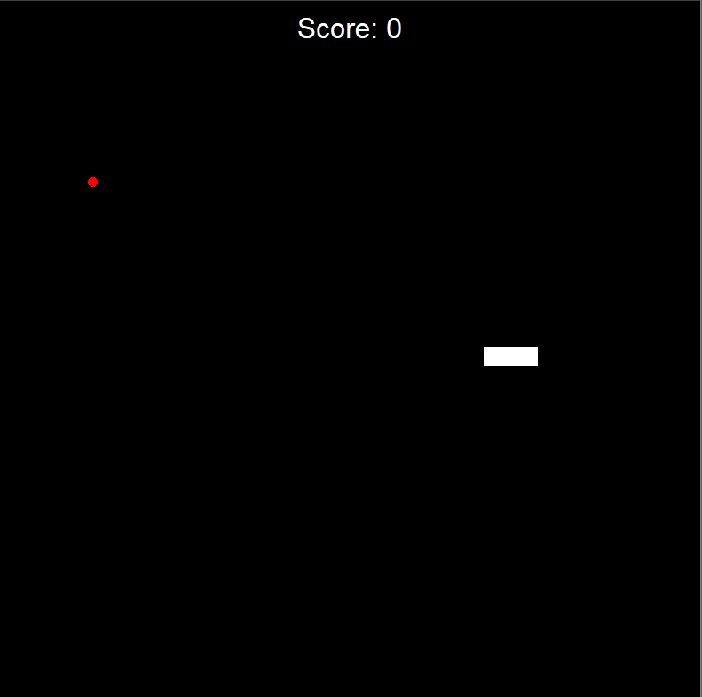

# Snake Game (Python - Turtle)

## Description
A classic Snake game built using Python's Turtle graphics module. The player controls the snake, eats food to grow, and avoids colliding with walls or itself.

## Features
- Real-time movement using keyboard controls
- Random food generation
- Score tracking system
- Collision detection (walls + self)
- Game over system

## Controls
- Arrow Up → Move Up  
- Arrow Down → Move Down  
- Arrow Left → Move Left  
- Arrow Right → Move Right  

## How to Run
1. Make sure Python is installed
2. Run the main file:
